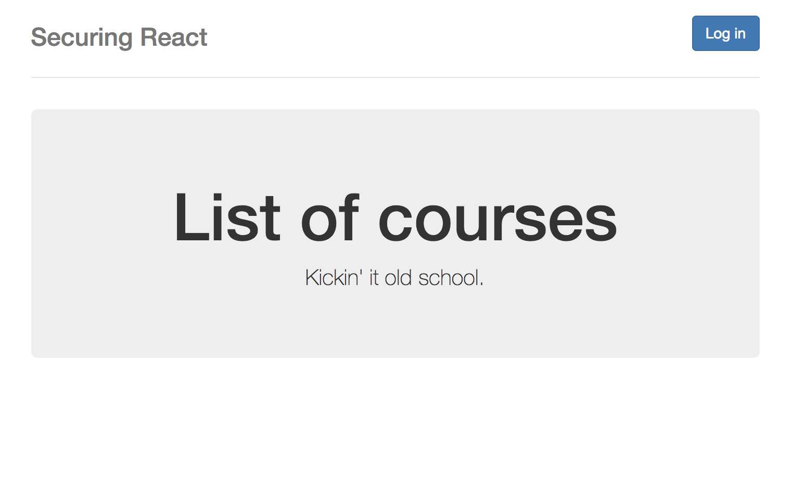

# Secure React App
Secure React app using Auth0 via client side and server side API.

* Node.js and Express API server
* JWT and Auth0
* Airbnb's best practice eslintrc with rules for .js and .jsx files
* Retrieves data from server folder

## Screenshot of Logged Out
<kbd></kbd>

## Screenshot of Logged In
<kbd></kbd>